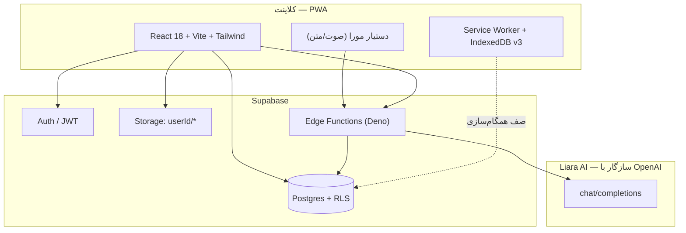
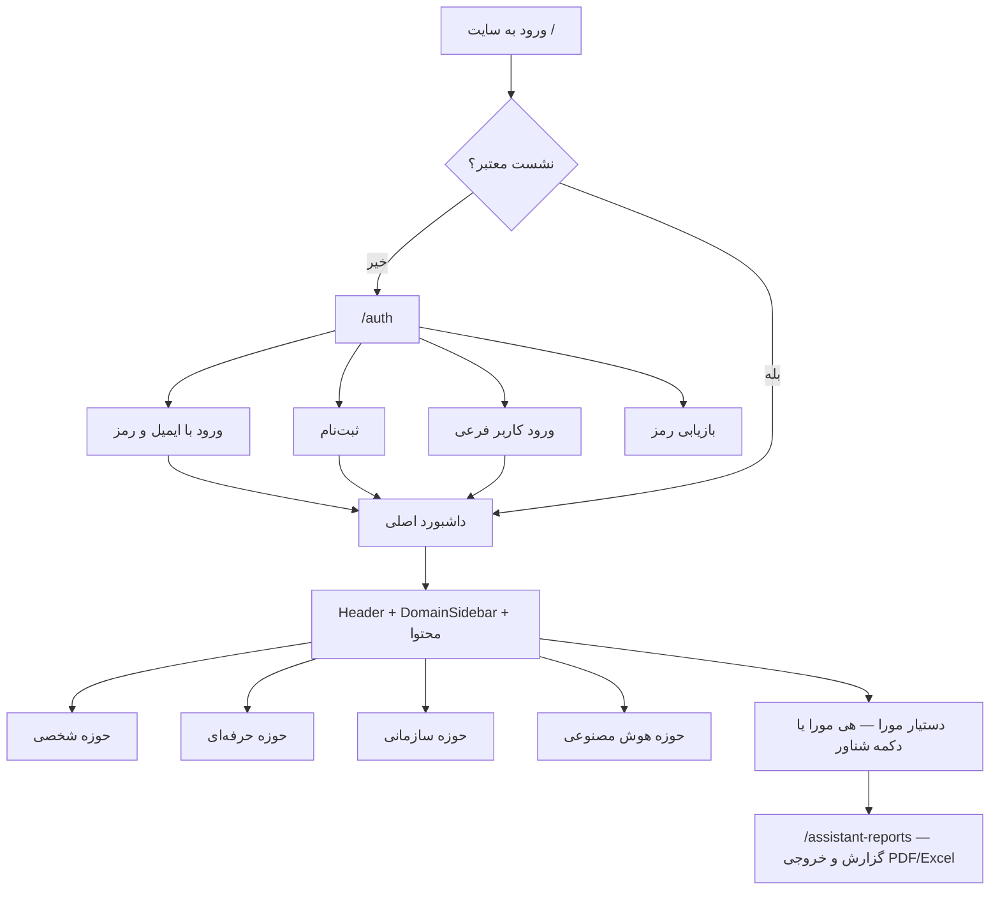
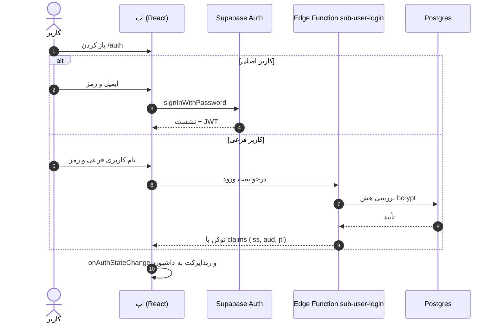
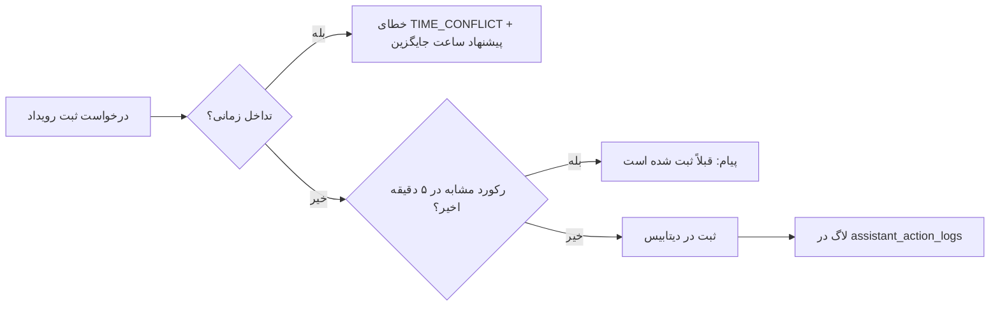
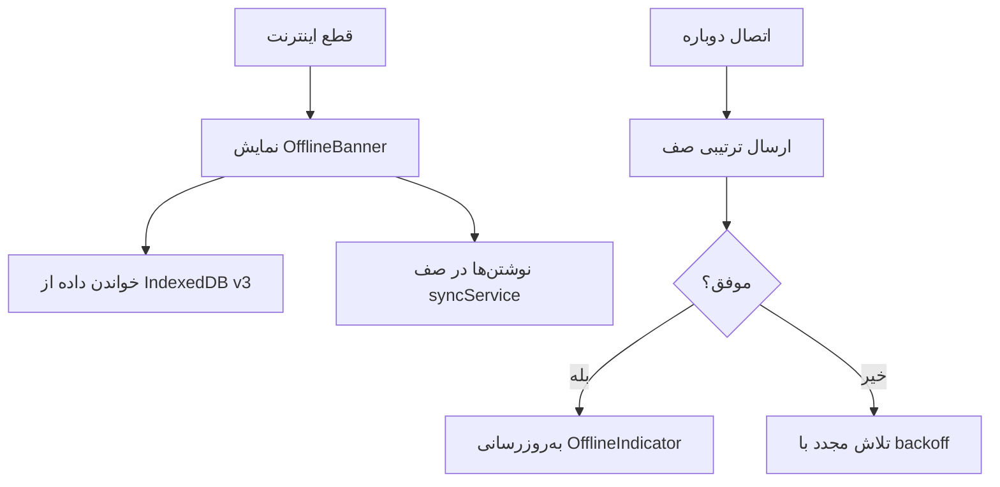
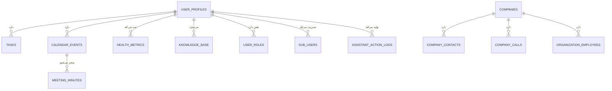
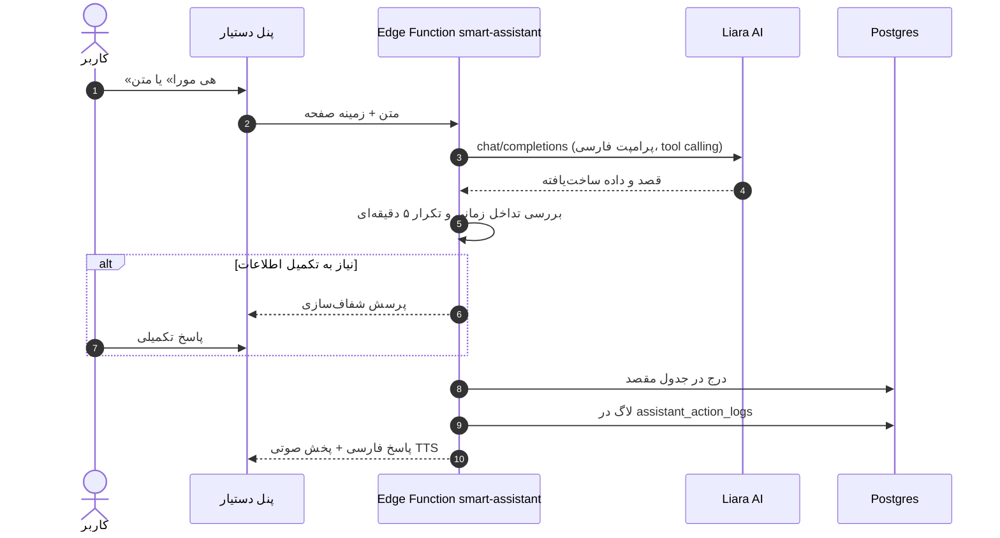
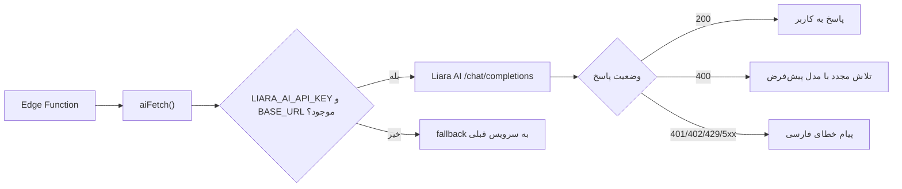

# مورا (Mora)

> مغز دوم دیجیتال و دستیار هوشمند اجرایی — فارسی، امن و آفلاین‌پذیر.

[](https://conventionalcommits.org)
[](https://web.dev/progressive-web-apps/)
[](#)

وب‌سایت: **https://www.aimora.app**

---

## فهرست

1. [درباره مورا](#۱-درباره-مورا)
2. [معماری پروژه](#۲-معماری-پروژه)
3. [راه‌اندازی سریع](#۳-راهاندازی-سریع)
4. [User Flow کامل](#۴-user-flow-کامل)
5. [نقشه صفحات و مسیرها](#۵-نقشه-صفحات-و-مسیرها)
6. [دستیار هوشمند مورا](#۶-دستیار-هوشمند-مورا)
7. [حالت آفلاین و PWA](#۷-حالت-آفلاین-و-pwa)
8. [امنیت و دسترسی](#۸-امنیت-و-دسترسی)
9. [طراحی و ریسپانسیو بودن](#۹-طراحی-و-ریسپانسیو-بودن)
10. [Edge Functions](#۱۰-edge-functions)
11. [راهنمای توسعه](#۱۱-راهنمای-توسعه)
12. [عیب‌یابی](#۱۲-عیبیابی)

---

## ۱. درباره مورا

مورا یک پلتفرم یکپارچه برای مدیران و متخصصان است که چهار حوزه‌ی زندگی کاری و شخصی را در یک محیط واحد جمع می‌کند:

| حوزه | چه کاری انجام می‌دهد |
|------|----------------------|
| **شخصی** | ژورنال، شکرگزاری، عادت‌ها، سلامت، برنامه‌ریزی شخصی، مخاطبین |
| **حرفه‌ای** | تقویم، جلسات، وظایف، پروژه‌ها، دانش، ایده‌ها، رزومه، ایمیل کاری |
| **سازمانی** | شرکت‌ها، منابع انسانی، استراتژی، جانشین‌پروری، ریسک، صورت‌جلسه |
| **هوش مصنوعی** | دستیار صوتی/متنی، تحلیل ایده، آمادگی جلسه، گزارش‌های هوشمند |

نکته کلیدی: **همه‌چیز فارسی است.** رابط کاربری RTL، تقویم شمسی، و دستیار هوش مصنوعی که همیشه فارسی پاسخ می‌دهد.

---

## ۲. معماری پروژه

### ۲.۱ نمودار معماری



### ۲.۲ ساختار پوشه‌ها

```text
repo/
├── frontend/            ← اپلیکیشن اصلی (Vite + React 18 + TS + Tailwind)
│   ├── src/
│   │   ├── pages/       ← صفحات مسیریابی‌شده
│   │   ├── components/  ← کامپوننت‌ها (ui/, assistant/, organization/, ...)
│   │   ├── services/    ← لایه دسترسی به داده و منطق کسب‌وکار
│   │   ├── hooks/       ← هوک‌های ری‌اکت (use-mobile, useOffline, useWakeWord)
│   │   ├── integrations/supabase/  ← کلاینت و تایپ‌های دیتابیس
│   │   └── index.css    ← توکن‌های طراحی + قواعد ریسپانسیو سراسری
│   └── public/          ← manifest.json, sw.js, robots.txt, sitemap.xml, fonts
├── supabase/
│   ├── functions/       ← Edge Functions (Deno)
│   └── migrations/      ← مهاجرت‌های SQL + RLS
└── package.json         ← اسکریپت‌های ریشه که به frontend واگذار می‌شوند
```

**استک:** React 18 · Vite 5 · TypeScript 5 · Tailwind CSS 3 · shadcn/ui · TanStack Query · Recharts · Supabase (DB/Auth/Storage/Edge Functions) · Liara AI (سازگار با OpenAI).

> خروجی build در پوشه‌ی `dist/` ریشه ساخته می‌شود (`npm run build`).

---

## ۳. راه‌اندازی سریع

```bash
npm install               # نصب وابستگی‌ها
npm run dev               # اجرای محیط توسعه
npm run build             # ساخت نسخه production در dist/
npm run lint              # بررسی کیفیت کد
```

متغیرهای محیطی مورد نیاز (در `frontend/.env`):

```
VITE_SUPABASE_URL=...
VITE_SUPABASE_PUBLISHABLE_KEY=...
```

کلیدهای حساس (OpenAI، Resend، Telegram، …) هرگز در فرانت‌اند قرار نمی‌گیرند؛ فقط به‌صورت Secret در Edge Functions.

---

## ۴. User Flow کامل

### ۴.۱ نمای کلی سفر کاربر



### ۴.۲ فلو احراز هویت

1. کاربر وارد `/` می‌شود؛ `Index` نشست Supabase را بررسی می‌کند.
2. اگر نشستی نبود → ریدایرکت به `/auth`.
3. در `/auth` سه تب وجود دارد: **ورود**، **ثبت‌نام**، **کاربر فرعی**.
4. پس از موفقیت، `onAuthStateChange` وضعیت را به‌روز و کاربر را به داشبورد می‌برد.
5. خروج از حساب از منوی Header انجام می‌شود و نشست و کش محلی پاک می‌شود.

> کاربران فرعی (Sub-user) رمزشان با bcrypt هش می‌شود و ورودشان از طریق Edge Function `sub-user-login` انجام می‌گیرد.



### ۴.۳ فلو کار روزانه (سناریوی نمونه)

| گام | کاربر چه می‌کند | سیستم چه می‌کند |
|-----|------------------|------------------|
| ۱ | صبح وارد داشبورد می‌شود | خلاصه‌ی امروز: وظایف سررسید، جلسات، عادت‌ها |
| ۲ | می‌گوید «هی مورا» | پنل دستیار باز و میکروفن فعال می‌شود |
| ۳ | «فردا ساعت ۱۰ جلسه با تیم مالی» | دستیار قصد را استخراج و تداخل زمانی را بررسی می‌کند |
| ۴ | تأیید می‌کند | رویداد در تقویم ثبت و در گزارش‌ها لاگ می‌شود |
| ۵ | وارد `/meetings/preparation` می‌شود | تحلیل آمادگی جلسه با هوش مصنوعی تولید می‌شود |
| ۶ | در `/assistant-reports` گزارش می‌گیرد | نمودار فعالیت + خروجی PDF/Excel |

### ۴.۴ فلو جلوگیری از تداخل و تکرار



### ۴.۵ فلو آفلاین



### ۴.۶ مدل داده‌ای اصلی



---

## ۵. نقشه صفحات و مسیرها

### عمومی
| مسیر | توضیح |
|------|-------|
| `/auth` | ورود / ثبت‌نام / کاربر فرعی |
| `/auth/signup` | ثبت‌نام مستقیم |
| `/accept-invitation/:token` | پذیرش دعوت‌نامه سازمان |

### شخصی
`/personal-dashboard` · `/personal-journal` · `/gratitude-journal` · `/habits` · `/health` · `/personal-planning` · `/contacts` · `/gadgets`

### حرفه‌ای
`/calendar` · `/meetings` · `/meetings/preparation` · `/tasks` · `/projects` · `/knowledge` · `/ideas` · `/legal` · `/resume` · `/business-email` · `/delegation` · `/professional-planning` · `/documentation`

### سازمانی
`/companies` · `/my-organizations` · `/organizations/new` · `/organizations/:id` (dashboard, settings, members) · `/organizational-planning` · `/social-responsibility` · `/csr-project/:id`

فضاهای سازمانی اختصاصی: `khadim-e-khalgh` · `varid` · `chamber` · `frangaran` — هرکدام با ماژول‌های سیاست/مأموریت، داشبورد، جانشین‌پروری، پیگیری مطالبات، صورت‌جلسه و ارزیابی ریسک.

### هوش مصنوعی و ابزارها
`/ai-chat` · `/ai-chat/analytics` · `/assistant-reports` · `/trends` · `/cultural-content` · `/social-media` · `/plaud` · `/hi-dock` · `/secretary-portal`

### مدیریتی
`/profile` · `/admin` · `/admin/users` · `/admin/sub-users` · `/admin/audit-logs` · `/debug/cleanup`

> فقط `/` و `/auth` در `sitemap.xml` ایندکس می‌شوند؛ بقیه پشت احراز هویت‌اند و در `robots.txt` مسیرهای `admin`، `debug` و `accept-invitation` مسدود شده‌اند.

---

## ۶. دستیار هوشمند مورا

**روش‌های فراخوانی:** کلمه بیدارباش «هی مورا» · دکمه شناور · میان‌بر در Header.

**قابلیت‌ها**
- تبدیل گفتار به متن و پاسخ صوتی (TTS فارسی).
- استخراج داده‌ی ساخت‌یافته و مسیریابی به جدول درست بر اساس نوع محتوا:
  - جلسه/رویداد → تقویم · وظیفه → tasks · سلامت → health_metrics
  - محتوای فنی → knowledge_base · محتوای فرهنگی → cultural_content
  - مخاطب با سازمان → company_contacts، در غیر این‌صورت personal_contacts
- گفت‌وگوی چندمرحله‌ای برای تکمیل اطلاعات ناقص پیش از ذخیره.
- اجرای خودکار فقط برای اقدامات whitelist‌شده؛ موارد حساس نیاز به تأیید در UI دارند.
- بررسی تداخل زمانی و جلوگیری از ثبت تکراری (پنجره ۵ دقیقه‌ای).
- ثبت هر اقدام در `assistant_action_logs` برای گزارش‌گیری.



**گزارش‌گیری** در `/assistant-reports`: فیلتر روزانه/هفتگی/ماهانه/بازه دلخواه، نمودار Recharts، خروجی PDF و Excel.

---

## ۷. حالت آفلاین و PWA

- `public/manifest.json` با `id` و `start_url` مطلق روی دامنه، آیکون‌ها و `display: standalone`.
- Service Worker در `public/sw.js`؛ کش نسخه‌دار و **عدم کش‌کردن `/assets/`** تا فایل‌های هش‌دار همیشه از شبکه بیایند.
- IndexedDB نسخه ۳ برای داده‌ی آفلاین و `syncService.ts` برای صف همگام‌سازی.
- نصب روی موبایل: «افزودن به صفحه اصلی» در مرورگر.

> اگر پس از انتشار نسخه‌ی قدیمی کش شده دیدید: `Ctrl/Cmd + Shift + R` یا Unregister کردن Service Worker در DevTools.

---

## ۸. امنیت و دسترسی

- **RLS** روی همه‌ی جدول‌های کاربری؛ کوئری‌ها همیشه با `user_id`/`author_id` محدود می‌شوند.
- **نقش‌ها** در جدول جداگانه‌ی `user_roles` با تابع `has_role` (SECURITY DEFINER) — هرگز روی پروفایل ذخیره نمی‌شوند.
- **Storage**: مسیر هر فایل باید با `${userId}/` شروع شود تا از سیاست‌ها عبور کند.
- ستون‌های حساس (`password_hash`, توکن‌های OAuth) از دسترس `SELECT` خارج‌اند.
- Edge Functions: اعتبارسنجی ورودی با Zod، CORS با allowlist مشخص، کلیدها فقط سمت سرور.
- لاگ حسابرسی برای بازنشانی رمز و اقدامات مدیریتی.

---

## ۹. طراحی و ریسپانسیو بودن

**سیستم طراحی «Liquid Glass»:** backdrop-blur، گرادیان‌های شعاعی، پس‌زمینه‌ی Aurora، تایپوگرافی Vazirmatn (سرو محلی، بدون CDN). همه‌ی رنگ‌ها توکن معنایی در `index.css` هستند — هیچ رنگ hardcode در کامپوننت‌ها.

**نقاط شکست**

| بازه | چیدمان |
|------|--------|
| `< 768px` موبایل | سایدبار به‌صورت Drawer با backdrop و سوایپ، ناوبری پایین (`MobileOptimizedNav`)، padding فشرده، تب‌ها اسکرول افقی |
| `768–1023px` تبلت | سایدبار جمع‌شونده، دو ستونه، جدول‌ها با اسکرول افقی |
| `≥ 1024px` دسکتاپ | سایدبار ثابت (باز `mr-72` / جمع `mr-16`)، شبکه‌های چندستونه |
| `≥ 1536px` نمایشگر عریض | محتوا در `max-width: 1600px` وسط‌چین می‌شود |

**قواعد سراسری ریسپانسیو** (انتهای `frontend/src/index.css`)
- جلوگیری از overflow افقی در `html/body/#root`.
- `max-width: 100%` برای تصاویر، ویدیو، svg و iframe.
- شکستن رشته‌های طولانی در متن‌ها و سلول‌های جدول.
- محدودکردن عرض‌های ثابت (`w-[...]`, `min-w-[...]`) در موبایل، با استثنا برای جدول‌های ذاتاً پهن که اسکرول افقی می‌گیرند.
- تب‌ها (`[role="tablist"]`) در موبایل اسکرول افقی بدون اسکرول‌بار.
- `font-size: 16px` برای ورودی‌ها تا iOS زوم نکند.
- حداقل هدف لمسی ۴۴px برای دکمه‌ها.
- دیالوگ‌ها در موبایل `calc(100vw - 1.5rem)`.

**هوک‌های کمکی:** `useIsMobile`، `useDeviceDetection`، `useAdaptiveLayout`، `useResponsiveBreakpoints`.

---

## ۱۰. Edge Functions

| تابع | کار | سرویس مدل |
|------|-----|-----------|
| `smart-assistant` | مغز دستیار: استخراج قصد، مسیریابی داده، پاسخ فارسی | Liara AI |
| `meeting-preparation` | تحلیل آمادگی جلسه با retry و fallback | Liara AI |
| `analyze-idea` | تحلیل ۸ بخشی ایده (Overview, BMC, SWOT, Strategy, …) | Liara AI |
| `ai-chat`, `ai-assistant` | گفت‌وگوی عمومی و پیشنهاددهی | Liara AI |
| `perplexity-proxy` | خلاصه‌سازی و ساخت مایندمپ | Liara AI |
| `speech-to-text` | تبدیل گفتار به متن | Whisper |
| `generate-business-email`, `generate-networking-email` | تولید ایمیل بومی‌سازی‌شده | Liara AI |
| `send-email`, `send-delegation-email/sms` | ارسال از طریق Resend / SMS |
| `telegram-bridge` | پل تلگرام با احراز هویت و لاگ حسابرسی |
| `plaud-*`, `hi-dock-*` | همگام‌سازی دستگاه‌های ضبط |
| `create-user`, `create-sub-user`, `sub-user-login`, `reset-password`, `list-users` | مدیریت کاربران |

---

## ۱۰.۱ پیکربندی هوش مصنوعی (Liara)

همه‌ی فراخوانی‌های مدل از `supabase/functions/_shared/liaraAI.ts` عبور می‌کنند. هر تابع AI این ماژول را به‌جای `fetch` سراسری import می‌کند، بنابراین مسیر مدل در یک نقطه متمرکز است.

| متغیر محیطی | توضیح |
|--------------|-------|
| `LIARA_AI_API_KEY` | کلید Liara (فقط سمت سرور، در Secret store) |
| `LIARA_AI_BASE_URL` | مثل `https://ai.liara.ir/api/v1/<service-id>` |
| `LIARA_AI_MODEL` | اختیاری؛ مدل پیش‌فرض را بازنویسی می‌کند |



نگاشت مدل‌ها: نام‌های `gemini` به `google/gemini-2.0-flash-001`، نام‌های `gpt-4o/4.1` به `openai/gpt-4.1` و بقیه به `openai/gpt-4o-mini` نگاشت می‌شوند.

---

## ۱۱. راهنمای توسعه

### Conventional Commits

```
type(scope?): subject

feat: add meeting upload functionality
fix: resolve authentication bug in login
docs: update installation guide
```

انواع مجاز: `feat` · `fix` · `docs` · `style` · `refactor` · `perf` · `test` · `chore` · `build` · `ci`

### قواعد کدنویسی
- بدون `console.log` در production — از `logger.ts` استفاده کنید.
- کتابخانه‌های سنگین (Tesseract، pdf.js، xlsx، jsPDF) حتماً **dynamic import**.
- رنگ‌ها فقط از توکن‌های معنایی؛ `text-white`/`bg-black` ممنوع.
- هر کوئری دیتابیس باید به‌صراحت با شناسه کاربر فیلتر شود.

---

## ۱۲. عیب‌یابی

| نشانه | راه‌حل |
|-------|--------|
| `Failed to fetch dynamically imported module` | Service Worker قدیمی؛ hard refresh یا Unregister |
| `Failed to send request` در Edge Function | مبدأ در allowlist `_shared/cors.ts` نیست |
| داده‌ی کاربر دیگری دیده می‌شود | فیلتر `user_id` در کوئری جا افتاده |
| آپلود فایل رد می‌شود | مسیر باید با `${userId}/` شروع شود |
| دستیار انگلیسی جواب می‌دهد | prompt الزام فارسی در `smart-assistant` بررسی شود |
| `dist-check failed` | build باید در `dist/` ریشه خروجی بدهد |

---

© مورا — همه حقوق محفوظ است.